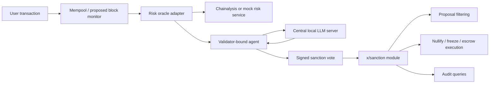
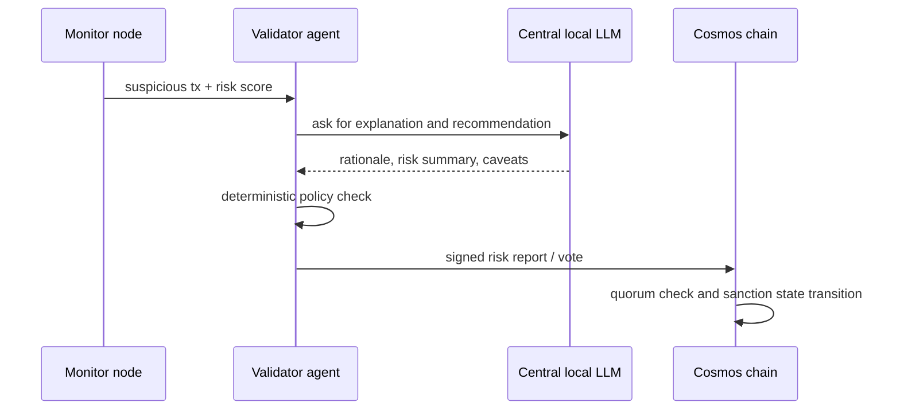

# AI agent based transaction sanction system design

## 1. Purpose

本設計書は、暗号資産を用いた詐欺、犯罪、資金洗浄に関連する可能性が高い送金を検知し、AI エージェントによる合意形成を経て、Cosmos SDK ベースのブロックチェーン上でトランザクション承認の抑制または補償的な制裁処理を実行するシステムの全体設計を定める。

初期実装では、AI エージェントの判断支援に中央集権的に管理されたローカル LLM を利用する。将来的には、各バリデータが独立した AI エージェントまたは LLM を運用する分散型構成へ拡張できるようにする。

## 2. Background

暗号資産の送金は高速かつグローバルである一方、詐欺、盗難、ランサムウェア、資金洗浄に利用される場合がある。既存のアドレススクリーニングサービスは、特定アドレスのリスク評価、犯罪カテゴリ、制裁対象との関連、直接または間接的なエクスポージャを提供できる。

本システムでは、Chainalysis Address Screening などのリスク評価サービスを異常検知の入力として利用し、検知結果を AI エージェントが説明可能な形で整理する。その後、複数のバリデータに紐付いたエージェントが署名付き投票を行い、所定のしきい値を満たした場合に制裁を実行する。

## 3. Design Principles

- Consensus-critical code は deterministic にする。
- 外部 API、LLM、現在時刻、乱数、ネットワーク I/O を Cosmos SDK の state transition 内で直接呼び出さない。
- LLM は制裁の最終決定者ではなく、判断支援、説明生成、証拠整理に用いる。
- 制裁の正当性は、署名付きリスク報告、署名付き投票、オンチェーン状態遷移で担保する。
- 未確定トランザクションはブロック提案から除外し、確定済みトランザクションは独自チェーン上の補償処理、凍結、エスクロー移転として扱う。
- 監査可能性を重視し、すべての制裁判断について evidence hash、投票者、判断理由の hash、実行結果を保存する。
- 初期 PoC は中央ローカル LLM 方式で短期実装し、後続研究で分散 AI エージェント方式へ拡張する。

## 4. System Overview



主要コンポーネントは次の通りである。

| Component | Role |
| --- | --- |
| Transaction monitor | mempool、ブロック候補、確定ブロックを監視し、対象送金を抽出する |
| Risk oracle adapter | Chainalysis 等の外部サービスまたはモック API からリスク情報を取得する |
| Central local LLM server | リスク情報と取引文脈から、制裁判断の説明、反対可能性、必要証拠を生成する |
| Validator-bound agent | バリデータに紐付き、LLM 出力とルール判定を確認して署名付き投票を作成する |
| x/sanction | リスク報告、制裁提案、投票、制裁実行結果を保存する Cosmos SDK module |
| Proposal filtering | 制裁対象 tx を `PrepareProposal` または mempool selection で除外し、`ProcessProposal` で拒否する |
| Sanction executor | 確定済み tx に対して凍結、エスクロー移転、補償的巻き戻しを実行する |

## 5. Assumptions

- 対象チェーンは Cosmos SDK appchain とし、送金機能はチェーン側で制御可能である。
- バリデータ集合と各エージェントの公開鍵はオンチェーンまたは genesis で管理される。
- 初期 PoC では Chainalysis API の代わりに互換モック API を利用可能とする。
- 初期 PoC では中央ローカル LLM を利用し、各エージェントは同一 LLM サーバに問い合わせる。
- LLM サーバの出力は consensus に直接入れず、hash 化された説明、ルール判定、署名付き投票としてオンチェーンに提出する。
- 確定済み tx の「無効化」は、ブロック履歴自体の削除ではなく、チェーンの token module 上での補償的な状態遷移として実装する。

## 6. Main Flow

### 6.1 Pre-finality sanction

1. ユーザーが送金 tx を提出する。
2. 監視ノードが tx の送金先、送金元、金額、denom、memo、IBC 情報を抽出する。
3. Risk oracle adapter が外部リスクサービスに照会する。
4. リスクしきい値を超えた場合、エージェントが中央ローカル LLM に判断支援を依頼する。
5. LLM は制裁理由、証拠要約、留保事項を返す。
6. エージェントは deterministic な policy rule に基づいて `SanctionVote` を作成し、署名する。
7. 署名が quorum threshold を満たすと、`x/sanction` が対象 tx hash を `ActiveSanction` として保存する。
8. block proposer は `PrepareProposal` で対象 tx を除外する。
9. 他バリデータは `ProcessProposal` で対象 tx を含む提案を拒否する。

### 6.2 Post-finality sanction

1. 確定済みブロック内で疑わしい tx が検出される。
2. pre-finality と同じ手順でリスク報告、LLM 説明、署名付き投票を集める。
3. quorum threshold を満たすと、`MsgExecuteSanction` が発行される。
4. 対象 tx の効果を chain state から検証する。
5. sanction mode に応じて、受領口座の凍結、資金のエスクロー移転、または補償的巻き戻し tx を実行する。
6. 実行結果、対象 tx hash、投票者、証拠 hash、実行時 height を監査ログとして保存する。

## 7. AI Agent Model

初期構成では、AI エージェントは中央ローカル LLM を共有する。



LLM への入力には次を含める。

- tx hash
- sender address
- recipient address
- amount and denom
- risk score
- risk categories
- direct or indirect exposure
- source service name and response id
- past sanction records if available
- policy version

LLM からの出力には次を含める。

- recommended action: `none`, `watch`, `block`, `freeze`, `escrow`, `revert`
- rationale
- risk summary
- required evidence
- uncertainty and caveats
- natural language explanation for audit

ただしオンチェーンの最終判定は、LLM 出力ではなく `policy_version` に紐付く deterministic rule によって行う。

## 8. Policy Rule

PoC の最小ルールは次のようにする。

```text
if risk_score >= block_threshold
  and risk_category in high_risk_categories
  and evidence_expiry_height >= current_height
then sanction_action = block_or_freeze
else sanction_action = none_or_watch
```

標準パラメータ案:

| Parameter | Default | Description |
| --- | ---: | --- |
| `watch_threshold` | 60 | 監視対象にするリスクスコア |
| `block_threshold` | 80 | 未確定 tx を抑制するリスクスコア |
| `freeze_threshold` | 85 | 確定済み tx の受領口座を凍結するリスクスコア |
| `revert_threshold` | 90 | 補償的巻き戻しを許可するリスクスコア |
| `quorum_threshold` | 0.67 | 制裁成立に必要な投票権比率 |
| `unanimous_required_for_revert` | true | 巻き戻し系処理に全員署名を要求するか |
| `evidence_ttl_blocks` | 100 | リスク報告の有効期間 |

## 9. On-chain Modules

### 9.1 x/riskoracle

外部リスク評価の結果をオンチェーンで参照できる形式に正規化する。PoC では `x/sanction` に内包してもよい。

主な state:

```text
RiskReport/{report_id} -> RiskReport
RiskReportByTx/{tx_hash}/{report_id} -> true
RiskReportByAddress/{address}/{report_id} -> true
RiskOracleParams -> accepted_sources, evidence_ttl_blocks
```

### 9.2 x/sanction

制裁提案、投票、実行を管理する中核 module。

主な state:

```text
Agent/{agent_id} -> AgentInfo
SanctionCase/{case_id} -> SanctionCase
SanctionVote/{case_id}/{agent_id} -> SanctionVote
ActiveTxSanction/{tx_hash} -> ActiveSanction
FrozenAddress/{address} -> FreezeRecord
ExecutedSanction/{case_id} -> ExecutionRecord
Params -> thresholds, quorum, allowed_actions
```

### 9.3 Proposal filtering

Cosmos SDK app は、`x/sanction` の active sanction state を参照して、ブロック提案時と提案検証時に対象 tx を扱う。

- `PrepareProposal`: active sanction に該当する tx を提案から除外する。
- `ProcessProposal`: active sanction に該当する tx を含むブロック提案を reject する。
- `CheckTx`: 可能であれば mempool 受理前に rejected とする。

## 10. Security Considerations

- LLM prompt injection: tx memo や外部説明文を LLM に渡す場合は、構造化入力に閉じ込め、policy rule を上書きさせない。
- Central LLM compromise: LLM 出力だけでは制裁できない設計にし、各エージェント署名と policy rule を必須にする。
- False positive: 監査ログ、異議申し立て、制裁解除 tx を用意する。
- Validator censorship abuse: quorum threshold、公開監査、appeal mechanism により単独バリデータの恣意的抑制を防ぐ。
- External oracle failure: oracle timeout 時は即時制裁せず `watch` 扱いにする。
- Determinism: LLM と外部 API の結果は off-chain evidence とし、chain state transition は署名済み入力のみを検証する。
- Privacy: 送金文脈を LLM に渡す場合、PoC ではローカル LLM に限定し、外部 LLM API へ送信しない。

## 11. Evaluation Plan

評価指標は次の通りである。

| Metric | Description |
| --- | --- |
| detection latency | tx 観測からリスク報告作成までの時間 |
| consensus latency | リスク報告から quorum 達成までの時間 |
| pre-finality block success rate | finality 前に対象 tx を除外できた割合 |
| post-finality sanction success rate | 確定済み tx に対して補償制裁を実行できた割合 |
| false positive rate | 正常 tx を制裁対象にした割合 |
| false negative rate | 危険 tx を見逃した割合 |
| explanation completeness | 監査に必要な根拠項目が揃った割合 |
| scalability | バリデータ数、tx 数、risk report 数に対する遅延と負荷 |
| resilience | LLM、oracle、agent の障害時に chain が停止しないこと |

## 12. Prototype Milestones

1. `x/sanction` の state、msg、query の proto 定義。
2. Chainalysis 互換の mock risk service。
3. 中央ローカル LLM server adapter。
4. validator-bound agent CLI。
5. 署名付き `RiskReport` と `SanctionVote` の提出。
6. quorum 判定と `ActiveTxSanction` 保存。
7. `PrepareProposal` / `ProcessProposal` による tx 除外。
8. `MsgExecuteSanction` による凍結またはエスクロー移転。
9. 評価スクリプトと実験データセット。
10. 監査 query と可視化。

## 13. Future Extensions

- 各バリデータが独自 LLM を運用する fully distributed agent mode。
- Vote Extensions による高速なリスク報告集約。
- IBC transfer への対応。
- ゼロ知識証明または confidential computing によるプライバシ保護型リスク照会。
- 人間の監査者を含む hybrid DAO。
- 制裁解除、異議申し立て、補償制度のオンチェーン化。
